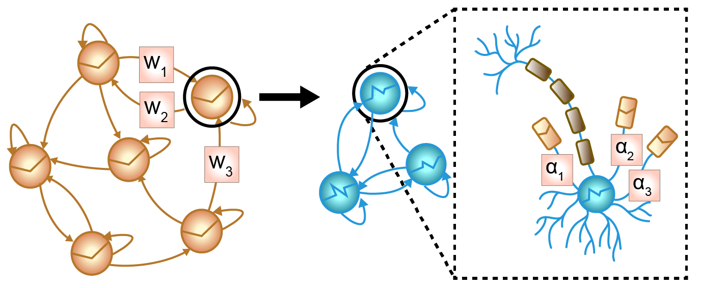

# **Tractable Dendritic RNNs for Reconstructing Nonlinear Dynamical Systems** [ICML 2022 Spotlight]

## About

This repository provides the code to the paper **Tractable Dendritic RNNs for Reconstructing Nonlinear Dynamical Systems** as accepted at the [ICML 2022](https://icml.cc/Conferences/2022). This work augments RNN units with elements from dendritic computation to increase their computational capabilites in turn allowing for low dimensional RNNs. We apply these models to the field of dynamical systems reconstruction, where low-dimensional representations are , The repository is split into two codebases providing different approaches to the estimation of parameters of the dendritic, piecewise linear recurrent neural network (dendPLRNN). The folder `BPTT_TF` contains the codebase using backpropagation through time (BPTT) based training paired with teacher forcing (TF), whereas `VI` embeds the dendPLRNN in a variational inference (VI) framework in the form of a sequential variational autoencoder (SVAE). All code is written in Python using [PyTorch](https://pytorch.org/) as the main deep learning framework.

## Citation
If you find the repository and/or paper helpful for your own research, please consider citing our work:
```
@article ...
```

## Acknowledgements
This work was funded by the German Research Foundation (DFG) within Germany’s Excellence Strategy – EXC-2181 – 390900948 (’Structures’), by DFG grant Du354/10-1 to DD, and the European Union Horizon-2020 consortium SC1-DTH-13-2020 ('IMMERSE').